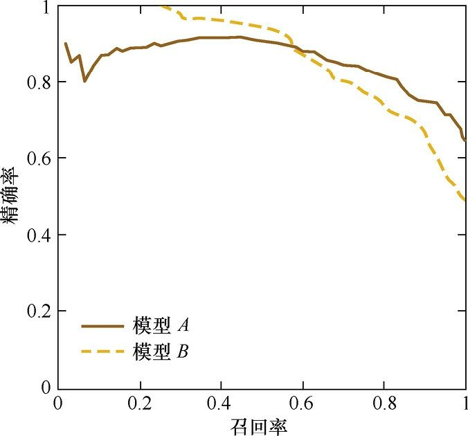

# 机器学习模型性能指标

如果让训练出来的模型对所有测试样本进行预测，按照真实结果和预测出来的结果可以分为：

|预测 \ 真实|Positive|Negative|
|-|-|-|
|True|真阳性 TP（True Positive）|真阴性 TN（True Negative）|
|False|假阳性 FP（False Positive）|假阴性 FN（False Negative）|

对其结果的正确性进行分析：

- TP：把正样本预测为True，即结果正确
- TN：把负样本预测为True，即结果错误
- FP：把正样本预测为False，即结果错误
- FN：把负样本预测为False，即结果正确

## 基本指标
### 准确率Accuracy

准确率定义的是预测出来的正样本占总样本的比率。

*Accuracy = (TP + TN) / (TP + TN + FP + FN)*

在实际工作中，准确率并不能很好的反应模型的效果，尤其在**样本不平衡的情况下**。

### 精确率Precision

在定义上，精确率针对的是**预测结果**的，它表示在所有预测结果中，真正的正样本占了多少比率。在信息检索领域，准确率也称为**查准率**，表示检索出的相关信息在所有信息中的比例。

*Precision = TP / (TP + FP)*

从语义上理解，**Precision**的含义为精准、准确，比如精准扶贫、精准营销、精准农业，都是从效率方面做出的度量，表示花费更少的能量和资源，达成更多的结果。在ML中，它也就表示在所有预测出的结果中，有多少结果是值得信赖的。

### 召回率Recall

召回率针对的是**原始样本**，即由模型预测出来的正样本在所有的原始样本中占了多少比率。要注意的是，所有原始正样本经过模型预测之后，会有两种结果：**一个是真正预测正确的True Positive类，另一类则是被预测为False的Negative样本，即False Negative**。在IR中，召回率也表示**查全率**，表示检索出的相关信息在系统所有相关信息中的比率。

*Recall = TP / (TP + FN)*

**Recall**的含义为召回，比如某个汽车生产商又要召回几十万、几百万有问题的车，以解决某些潜在问题。很明显，它表示在真实环境中，一些事物因为某些原因需要被处理。而在ML中，自然而然就表示检测出的结果占所有真实相关结果的比率。

### F1 Score

对于一个机器学习模型来说，最理想的情况就是精确率和召回率都要高，这样才能达到使用标准。然而，一般情况下，精确率和召回率只能顾其一，通常精确率高召回率就会低，召回率高准确率就会低。

所以，为了能够对精确率*P*和召回率*R*有一个全局度量，就有了*F1*值，它们之间的关系如下：

*2/F1 = 1/P + 1/R*

*F1 = 2PR/(P+R)*

## ROC曲线

虽然上面这些指标已经能够度量一个模型的性能，但对于样本不平衡的案例依然存在问题。

### 基础概念

先介绍几个概念：灵敏度Sensitivity，也叫真正率**TPR**、特异度Specificity，也叫假真率**FPR**。灵敏度和上面提到的召回率是同一个意思。

*Sensitivity = TP / (TP  + FN)*

*Specificity = TN / (FP + TN)*

*TPR = Sensitivity = TP / (TP  + FN)*

*FPR = 1- Specificity = FP / (FP + TN)*

真正率TPR，表示在所有预测正确的样本中，真阳性样本占了多少比率；假正率FPR，表示在所有预测错误的样本中，正样本占了多少比率。很明显，我们希望TPR越来越高，而FPR越来越低。

### ROC受试者特性曲线

ROC（Receiver Operating Characteristic）最初是在二战期间应用于雷达信号检测。它是以真正率TRP作为纵坐标，以FPR作为横坐标，针对同一个模型在不同阈值（用来区分正负样本的某个特征值）的表现画出来的。

一个典型的ROC曲线如下：

根据ROC曲线的性质，我们可以知道**ROC曲线应该越陡峭越好**。

### AUC（Area Under Curve）

曲线下面积AUC，即为ROC曲线和两条坐标轴围起来区域的面积。当然，其面积越大，说明模型的性能更好。它的判断标准如下：

- 0.5：完全随机的效果，相当于没起到任何作用；
- 0.5 - 0.7： 效果较低，但用于预测股票已经很不错了；
- 0.7 - 0.85： 效果一般；
- 0.85 - 0.95： 效果很好；
- 0.95 - 1： 效果非常好，但不太可能。

# 参考
- [知乎：准确率和召回率之间的区别](https://www.zhihu.com/question/19645541)
- [AIQ：一文让你彻底理解准确率、精准率…](https://www.6aiq.com/article/1549986548173)
- [PLoB：全面了解ROC曲线](https://www.plob.org/article/12476.html)