# HTTP

**HTTP（HyperText Transfer Protocol）超文本传输协议，是基于位于传输层，提供可靠字节流服务的TCP协议，在应用层实现的、用明文传输的无状态网络协议**。因为简单易用，**HTTP协议成为因特网上使用最多的协议**，和**HTML、URI**是构成万维网的基础。

在互联网发展的早期，在网上共享资源非常麻烦，通常需要使用FTP文件传输协议，先登录至特定主机上，再下载特定位置的资源到本地使用。

> 在URL出现之前，要想和朋友共享complete-catalog.xls文件，就得说这样的话：”用FTP连接到ftp.joes-hardware.com上。用匿名登录，然后输入你的用户名作为密码。变化到pub目录。转换为二进制模式。先在，可以将名为complete-catalog.xls的文件下载到本地文件系统，并在那里浏览这个文件了。“
>
> ——《HTTP权威指南》

### 历史

1989年，欧洲核子研究组织CERN的**蒂姆·博纳斯-李**开始制定HTTP协议，目的是为了**让在互联网上共享资源变得更加方便容易**。到目前为止，HTTP主要有四个版本。

- 1991年，初始版本被制定，当时还没有建立标准，因此被称为HTTP/0.9；
- 1996.5，HTTP正式作为标准被公布，即HTTP/1.0，并记载于RFC1945；
- 1997.1，公布的HTTP/1.1是当前主流的版本，当时的标准是RFC2068；
- 1999，发布HTTP/1.1的改进版，记载于RFC2616；
- 2014提交HTTP/2，直到2015.2.17才被批准，在2015.5以RFC7540正式发布。

### 资源

HTTP协议诞生的目的就是为了在互联网上实现资源共享，让人们无论身处何处都能方便地获取资源。既然如此，就**需要用一种机制对互联网上的一切资源进行抽象**，以能够表示和真正使用资源。

> This document describes the syntax and semantics for a compact string representation for a resource available via the Internet.  These strings are called "Uniform Resource Locators" (URLs).
>
> The specification is derived from concepts introduced by the World-Wide Web global information initiative, whose use of such objects dates from 1990 and is described in "Universal Resource Identifiers in WWW", RFC 1630. The specification of URLs is designed to meet the requirements laid out in "Functional Requirements for Internet Resource Locators" [12].
>

关于更多URL的说明见: [RFC1738](https://www.ietf.org/rfc/rfc1738)。

##### 类型

在互联网上有多种多样的资源，比如最常见的文本资源，照片、视频、音频、表格、HTML文档等。为了区分不同的资源类型，HTTP用**MIME**类型表示不同资源。

> 最初设计MIME（Multipurpose Internet Mail Extension，多用途因特网邮件扩展）是为了解决在不同的电子邮件系统之间搬移报文时存在的问题。MIME在电子邮件系统中工作得非常好，因此HTTP也采纳了它，用来描述并标记多媒体内容。
>
> ——《HTTP权威指南》

常用资源的MIME类型如下：

| 资源类型   | MIME类型                      |
| ---------- | ----------------------------- |
| HTML       | text/html                     |
| ASCII      | text/plain                    |
| JPEG       | image/jpeg                    |
| GIF        | image/gif                     |
| QuickTime  | video/quicktime               |
| PowerPoint | application/vnd.ms-powerpoint |

##### URI

**URI，Uniform Resource Identifer统一资源标识符**，对（因特网上）资源的表示形式做出了统一规定。有两种形式：

- **URL，Uniform Resource Locator，统一资源定位符**，用一个确切的位置信息标识一份资源或者一组资源。因为表达自然，URL已经成为URI的代名词。但URL有一个不那么严重的缺陷——如果资源被移动，URL就会失效。
- **URN，Uniform Resource Name，统一资源名**，用唯一的名字标识资源，主要是为了解决URL的不足。但需要更加复杂的架构设计，加上URL的广泛接受，URN几乎没人使用。

##### URI格式

URI的格式主要包含下面几部分：

- 方案名，即协议名，比如http，https，ftp，mailto
- 服务器名: 端口，http端口80，https端口443
- 资源路径
- 查询参数
- 片段标识符

##### 编码

URI使用US-ASCII字符集进行编码。由于ASCII字符集数量有限，很多字符都不能表示，比如中文字符。为了解决这类问题，可以通过**转义**转换为安全字符，格式是**%+两个ASCII码**。另外，还有一些保留和受限的字符。

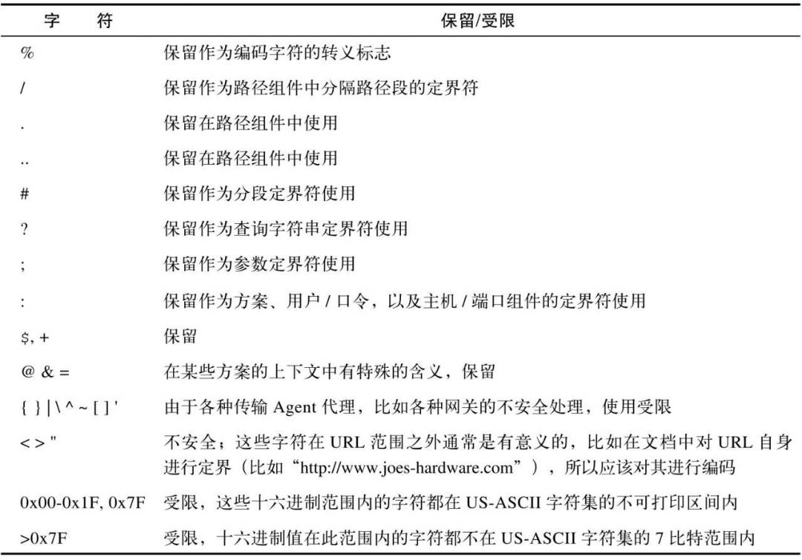

### 报文

##### 格式

客户端发送一个请求报文给服务器，服务器收到之后进行处理，然后再返回一个响应报文，整个过程称为一个HTTP事务。**请求报文**和**响应报文**的格式大致相同，都由三部分组成：

- **起始行**
  - 请求报文：方法` `URI` `协议版本号，比如 `GET https://www.itef.org/rfc/rfc2616 http/1.1`
  - 响应报文：协议版本号` `状态码` `状态文本，比如 `http/1.1 200 OK`
- **首部字段**
  - 通用首部，比如创建时间Date，连接特性Connection
  - 请求首部，比如可接受的媒体类型Accept，认证信息Authorization，主机Host等
  - 响应首部，比如资源创建使用的时间Age，资源的匹配信息ETag，重定向信息Location等
  - 实体首部，比如实体编码方式Content-Encoding，实体类型Content-Type（MIME类型）等
  - 扩展首部，比如缓存特性Cache-Control等
- **主体**
  - 请求报文：可有可无，比如使用GET方法时为空，使用POST方法时非空
  - 响应报文：一般都包含内容，比如HTML，JPEG图片等

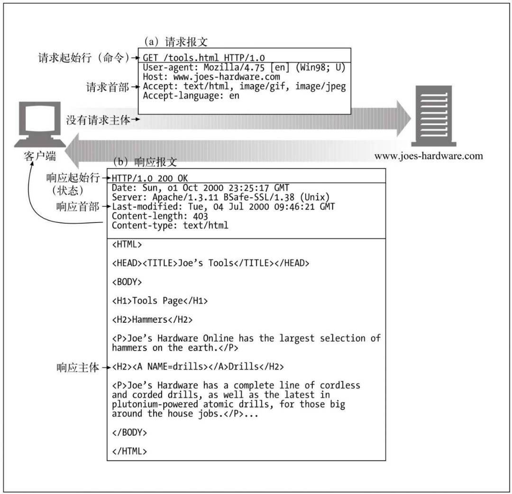

##### 方法

如同对本地资源会检索、修改、删除一样，通过HTTP协议也能通过不同方法操作因特网上的资源。主要的方法如下所示。

|  方法   | 描述                                                         |
| :-----: | ------------------------------------------------------------ |
|   GET   | 获取资源，属于安全操作                                       |
|  POST   | 被设计为向服务器输入数据，但实际上多用于提交表单数据         |
|   PUT   | 设计为向服务器上的资源写入数据，但实际上多用于修改表单数据   |
|  HEAD   | 类似GET，但只用于请求首部信息，比如判断资源类型、是否存在、是否被修改 |
| OPTIONS | 请求服务器支持的方法，比如询问某个特殊资源支持哪些方法       |
| DELETE  | 从服务器删除某项资源                                         |

##### 状态

状态分为**状态码**和**状态文本**，前者是一个三位正整数，后者以可读形式说明状态。

- 1xx，Informational，信息提示：接收的请求正在处理，HTTP/1.1才加入。
- 2xx，Success：请求正常处理完毕。
- 3xx，重定向，需要进行额外操作以完成请求
- 4xx，Client Error，客户端错误状态码，服务器无法处理请求
- 5xx，Server Error，服务器错误状态码，服务器自身出错

###### 信息性状态码

###### 成功状态码

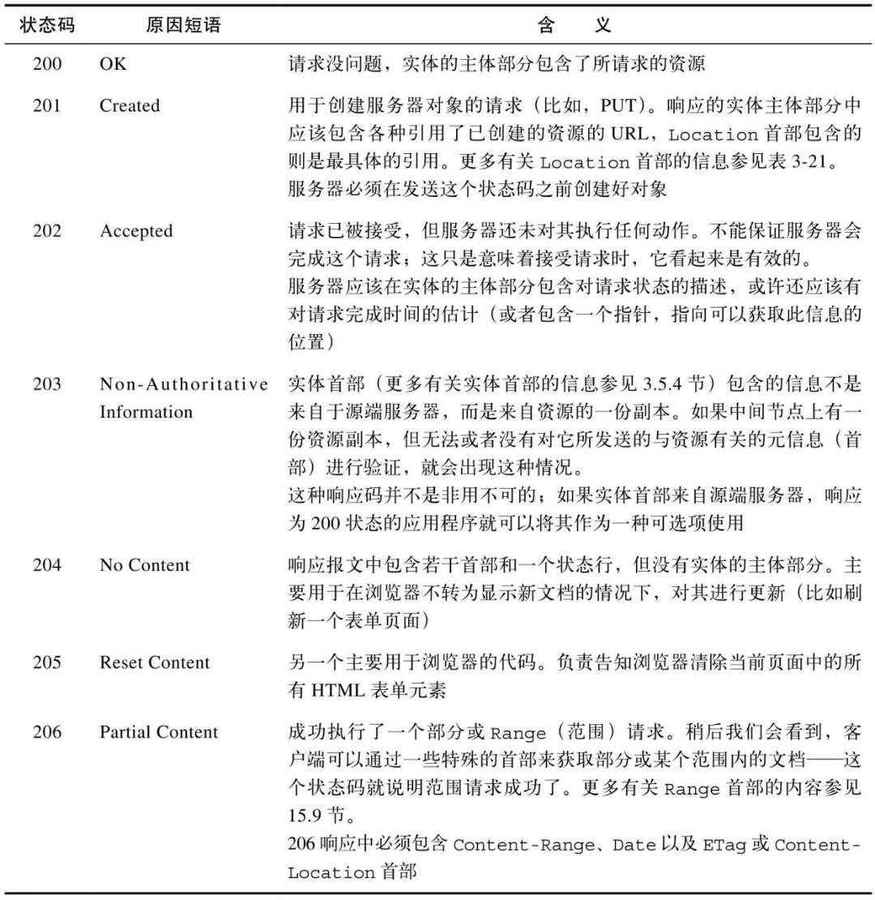

###### 重定向状态码

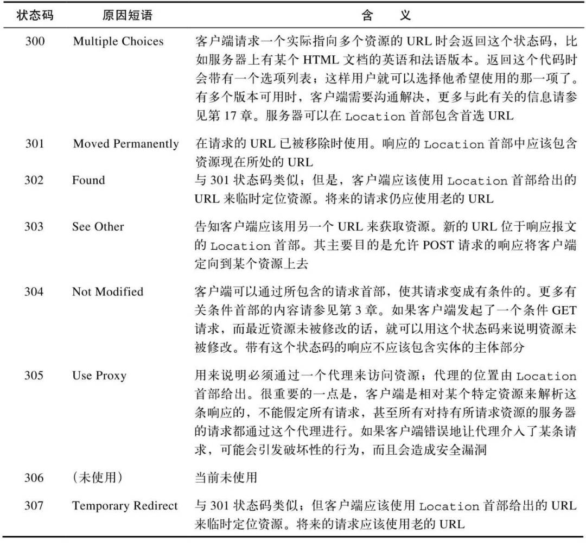

###### 客户端错误状态码

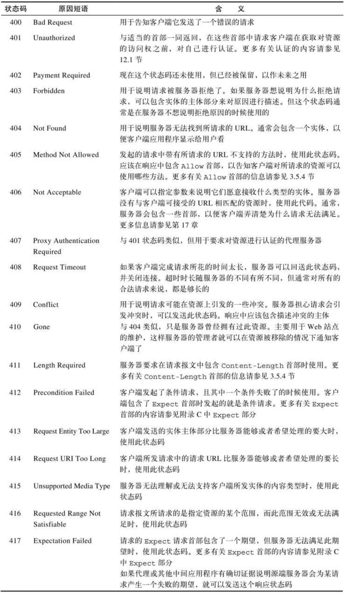

###### 服务器错误状态码

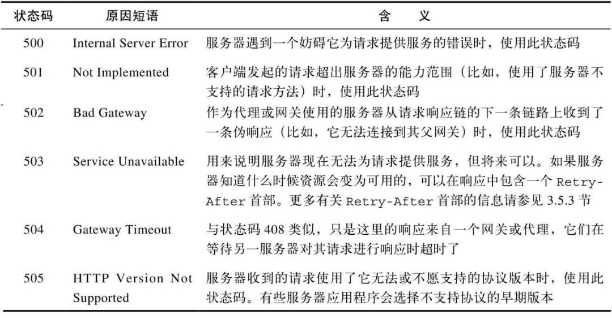

### 连接

HTTP作为应用层协议，在传输层使用TCP（Transmission Control Protocol）传输控制协议作为交换数据的载体。

##### TCP/IP

在使用HTTP协议的应用程序中，只要通过Socket套接字建立起TCP连接，就可以将任意类型的资源，以**字节流**的形式发送给传输层。

传输层把字节流分组、编号之后，加上源端口号和目的端口号，以及其他必要信息，发送给下层的网际层。

在网际层，将来自传输层的数据封装上源IP和目的IP，以及其他必要信息，构成数据报，发送给下层的数据链路层。

在数据链路层，通过硬件将数据报转换为比特，经过传输介质，到达目的主机之后，又以相反的顺序解包数据，最终完成数据交换。

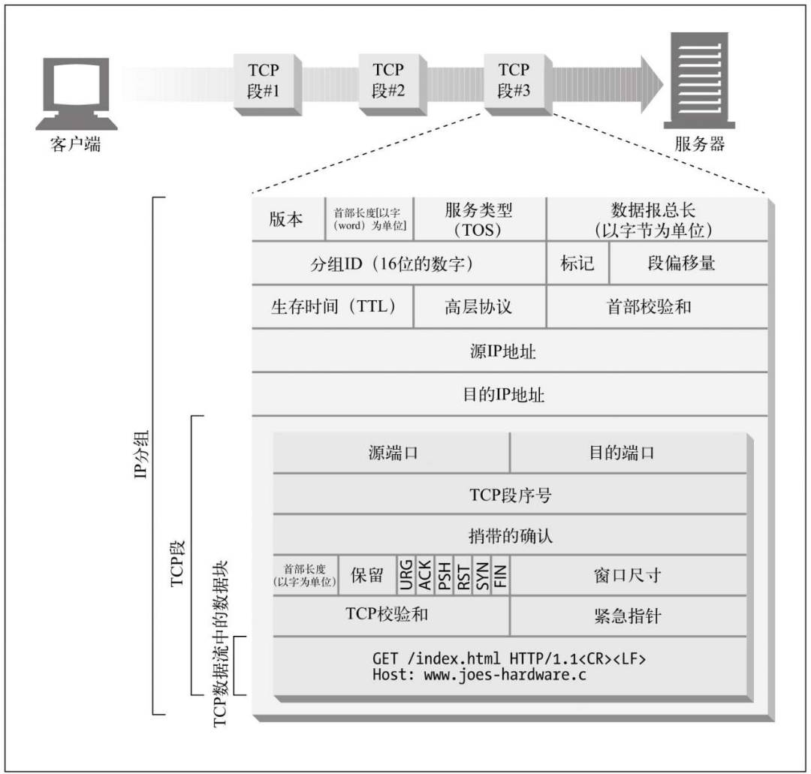

##### Socket套接字

> 套接字是对通信端点的抽象，是为了实现计算机之间的通信。——《UNIX环境高级编程》

由Unix操作系统发明的Socket技术，让计算机得以真正实现互联互通。现在所有的操作系统都提供了类似的实现，应用程序通过系统调用便可使用Socket技术。创建Socket的标准流程如下。

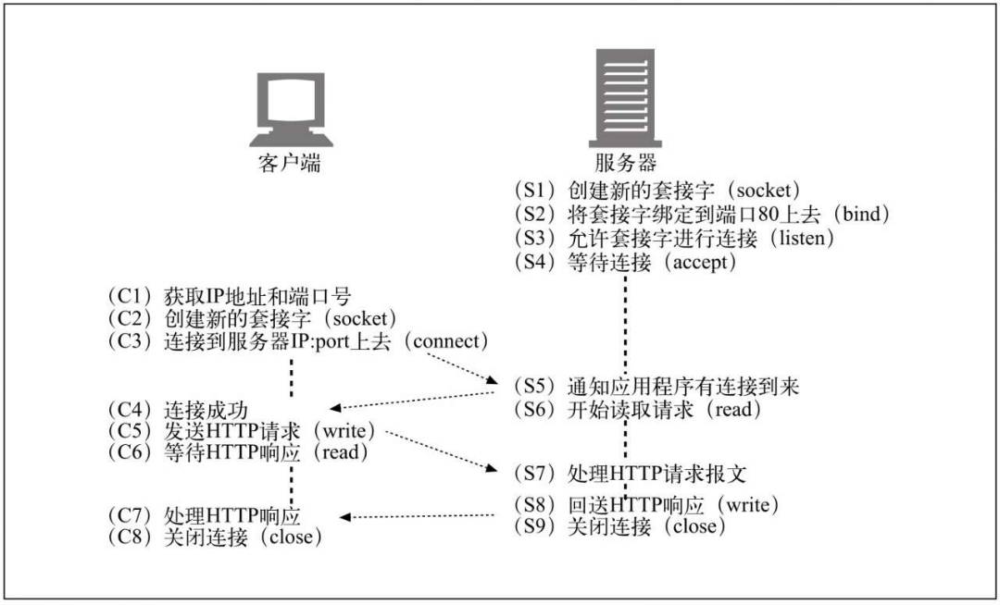

##### 性能

HTTP在下层使用TCP协议实现通信，这让它的性能很大程度上取决于TCP的表现。虽然在因特网的早期问题不明显，但互联网的普及和大量使用，性能问题显得越来越明显。像**在HTTP/1.1中默认支持持久连接，HTTP/2中的多路复用连接技术**，都是为了改善性能。

TCP为了提供可靠的逻辑连接服务，需要考考的问题包括：
- 可靠性
  - 数据损坏：为每一个Segment添加CheckSum校验和
  - 丢失：超时重传，ACK确认机制
  - 重复、乱序：Sequence Number每一个Segment都有一个唯一的序列号
- 流控
  - window size滑动窗口机制
  - ACK
- 拥塞控制
  - 慢启动
  - 拥塞避免
  - 快速重传
  - 快速恢复
- 多路复用
  - Address + Port
  - Socket

HTTP的性能问题主要在于两个方面：**HTTP事务的时延，TCP相关时延**。

###### HTTP事务时延

在一个HTTP事务中，会发生**DNS查询、建立连接、操作、传输**等过程。主要的性能问题发生在：

- DNS查询，如果是首次请求，通过DNS从URI获取IP地址的过程是耗时的，慢则需要数秒。
- TCP连接和应答，如果有很多客户端同时请求，时延是非常明显的。
- 处理和传输。一旦完成连接，建立传输通道，从收到请求到返回响应之间的时间。

###### TCP相关时延

TCP协议自身的一些机制也是制约HTTP性能的主要因素，包括：

- 三次握手
- 慢启动拥塞控制
- 数据聚集的Nagle算法
- 用于捎带确认的TCP延迟确认算法
- TIME WAIT时延和端口耗尽

##### 性能优化

在HTTP/1和HTTP/1.1中，已经在使用的用来提升性能的尝试包括：

- **并行连接**，实际上并发连接的提升的效果并不明显，因为代价是消耗大量系统资源。
- **持久连接**，HTTP/1.1用persistent默认支持持久连接，HTTP/1.0中虽然可通过keep-alive实现持久连接，但需要明确。
- **管道化连接**，HTTP/1.1允许在持久连接上可选地使用请求管道，相当于对keep-alive的又一性能优化。

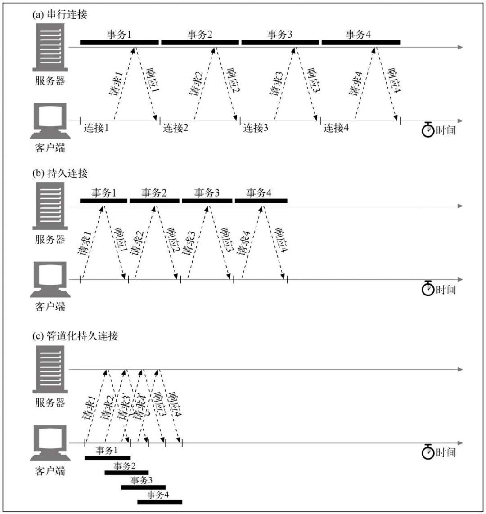

### HTTP/2

在HTTP/1.0、HTTP/1.1中已经支持的**持久连接、并行连接、管道化连接**虽然能够优化性能，但还存在进一步优化的空间。比如一些HTTP报文首部字段是重复冗余的，既增加了不必要的网络流量，也会让TCP在连接起初阶段很快填满拥塞窗口，导致延迟增加，性能降低。

在HTTP/2中加入以下特性，进一步提高性能，完善功能。

- **多路复用连接技术**，让单个连接能够处理多个请求和响应。
- **压缩报文首部字段**，降低需要传输的数据量。
- **请求可分优先级**，让高优先级的请求先处理。
- 从服务端到客户端**推送消息**。

### 组件

除过客户端Client和服务器Server，在HTTP请求和响应之间还有一些其他组件，它们一起组成HTTP的全貌。

- **代理**，作为中间人转发来自Client的请求给Server，收到Server的响应之后，再返回给Client。
  - **正向代理**，离客户端更近，主要用于转发请求，并对响应做某种操作，比如**缓存、过滤**等，缓存代理就是此类。
  - **反向代理**，离服务器更近，将来自客户端的请求根据某种规则分派给一组服务器中的某个，主要是为了**负载均衡、隐藏服务器IP**等。
- **网关**，同样是转发请求，但网关能够在不同协议之间转发请求，例如一个HTTP/FTP网关会将HTTP请求转发给后面的FTP服务器，回到响应之后，再封装成HTTP响应返回给客户端。
- **隧道**，对HTTP报文进行盲转发的特殊代理。
- **Agent代理**，发起自动HTTP请求的半智能Web客户端。

# HTTPS

### HTTP的不足

HTTP协议因为简单易用的特点获得了极大地成功，也实现了它最初的目标——**方便人们共享知识**。可是除过最初设定的使用场景，**HTTP现在已经被用在一切可用的场景中**，无论适不适合。比如传输个人银行账户和密码、身份证号等隐私信息。在这些场景中，HTTP原来的优点就会变成缺点。主要有三点：

- **安全性**。明文传输，在一些对机密性要求高的场景会泄密，比如通过抓包窃取个人隐私数据。
- **认证机制**。无法验证对方身份，数据可能被篡改，比如源服务器被代理替换为其他不受信任的服务器。
- **完整性**。无法确认数据的完整性，可能在传输过程中丢掉某些数据，比如丢到几个字符。

对于这些问题，一种常见的解决思路是：在应用程序内对机密数据加密，对方收到数据后，按照约定进行解密。可勉强满足需求，但要注意请求报文和响应报文中的首部字段无法加密。

另一种思路是，**在协议层面提供完备的加密、认证、签名机制，让HTTP变得安全可靠**。这就是HTTPS。

### 密码学

密码学的基础是数学，每一种加密算法都会在数学上得到严格证明。密码学主要解决四个核心问题，其中前三个是HTTP同样要解决的。

- **机密性**
- **完整性**
- **身份验证**
- 不可抵赖

##### Hash算法

Hash算法是现代密码学的核心组成部分。通过Hash算法，能够得到任意长度信息的固定长度摘要信息（哈希值、散列值、指纹）。有以下三个特点。

- **强抗碰撞性**：相同的消息的哈希值是一样的，不同消息的哈希值是不一样的，即使修改一小部分消息，也会发生巨大变化。
- **长度一致性**：不管消息长度是多少，所有信息生成的哈希值的长度都是一致的。
- **单向性**：不能或很难从哈希值反推出原始信息，唯一的办法就是暴力攻击、字典攻击等。

常见的哈希算法如下所示。

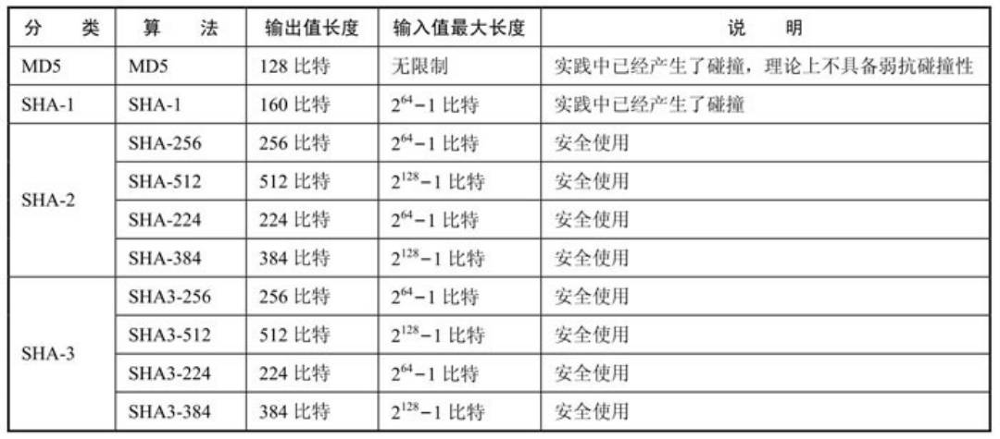

##### 对称加密

**所谓对称加密，就是加密和解密使用相同的密钥**，加密和解密是互逆操作。可分为两类：块密码算法和流密码算法，常见的对称加密算法包括AES、DES、RC4。

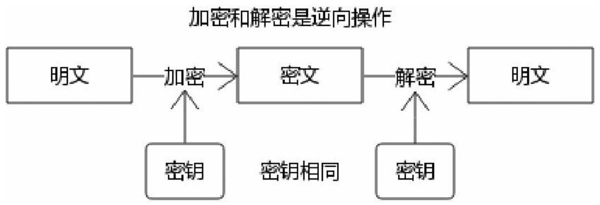

##### 消息验证码

在密码学应用的很多场景中，数据加密不加密其实不重要，**重要的是数据是不是完整且没有被篡改过的**。哈希算法只能解决数据完整性问题，却不能解决是否被篡改的问题（因为窃听者能在修改消息之后通过哈希算法算出新的摘要并替代原来的），这就需要消息验证码（Message Authentication Code）MAC算法。

MAC算法和Hash算法的区别在于前者生成验证码时需要密钥，**MAC值  = mac(消息，密钥)**，有两个特点：

- 证明信息没有被篡改，这和Hash算法是一致的。
- 证明信息是经过验证的。

MAC算法有两种形式，CBC-MAC算法，HMAC算法。

##### 公开密钥算法

公开密钥算法也叫非对称加密算法，相比对称加密算法能实现更高的机密性。公开密钥算法有一对密钥：可公开的公钥public key和自己持有的私钥private key，**用公钥加密，只能通过私钥解密；用私钥加密，只能通过公钥解密**。加密和解密过程不对称，即名字的来源。

**非对称加密算法能够实现很高机密性的代价，就是性能非常低**，因为加密解密过程会进行大量的数学计算。鉴于此，公开密钥算法一般用来进行密钥协商或者数字签名，而不是对内容本身数据进行加密解密。

**使用最多的公开密钥算法是RSA算法，可用于加密解密、密钥协商、数字签名**。它是由Ron Rivest、Adi Shamir、Leonard Adleman三个人共同创建的，算法名称是用他们三人的名字首字母组成的。

###### 单向加密

如果通信双方只拥有一对密钥，一方持密钥，另一方持公钥，这种加密方式称之为单向加密。单向加密能够保证一定程度的机密性，但并不能完全保证机密性。

如果公钥被公开，用来加密信息；私钥被服务端持有，用来解密，这样情况下可以保证安全，因为只有私钥能解密，且它是私有的。但**如果反过来，用私钥加密，用公钥解密，因为公钥不是私有的，就有可能被其他人解密**，从而泄露隐私信息。

###### 双向加密

双向加密中，**通信双方各自拥有一对密钥，客户端持有自己的私钥和服务端的公钥，服务端持有自己的私钥和客户端的公钥**。通信过程如下所示。

- ① 客户端生产一对RSA密钥，连接到服务端之后，将自己的公钥发给对方；
- ② 服务端收到请求后，保存客户端的公钥，同样生成一对RSA密钥，将自己的公钥发给对方；
- ③ 客户端收到服务端的公钥之后，用来加密自己的机密信息，比如身份证号码，发送给对方期望获得账户余额信息；
- ④ 服务端收到请求之后，先用自己的私钥解密，得到客户端的身份证号码，通过计算获得其账户余额，然后用客户端的公钥加密，最后发送给对方；
- ⑤ 客户端收到应答之后，用自己的私钥解密，取出账户余额信息。

这就是双向加密过程，如果不考虑性能问题，可以保证安全性。

### SSL/TLS

##### 历史

解决HTTP安全问题的终极方案就是在TCP和HTTP之间加入SSL（Secure Sockets Layer）协议或者TLS（Transport Layer Security）协议。可以认为**TLS是SSL的升级版**。

> 网景浏览器作为最早的浏览器，极大地推动了HTTP协议的发展。网景公司为了解决HTTP的安全问题，在1994年创建了SSL协议，作为浏览器的一个扩展，主要用于HTTP。
>
> 后来，网景意识到还有很多其他的应用协议，比如SMTP、FTP同样也面临安全问题。于是思考是否有统一的方案解决互联网通信的安全问题。基于此，SSL协议逐渐成为一个独立的协议，用来保证网络通信的认证和安全问题。SSL协议有三个版本，分别是SSL v1、SSL v2、SSL v3。
>
> 1996年，IETF在SSL v3的基础上标准化了该协议，微软为这个新协议取名TLS v1.0，目前比较稳定的是TLS v1.2。
>
> ——《深入浅出HTTPS：从原理到实践》

##### 实现

SSL/TLS作为一种协议，和HTTP一样，都非常复杂，需要考虑很多问题，比如扩展性、适用性、性能等。在实现细节上，还要追求严谨性，尽可能减少问题和错误。

HTTPS协议的层次架构从上到下是这样的：

- HTTP
- SSL/TLS
- TCP
- IP
- 数据链路层

**在SSL/TLS具体的实现逻辑中，会用到一组加密算法，称之为密码套件，还有随机数等加密基元**。用到的算法包括：

- 身份验证算法
- 密码协商算法
- 非对称加密算法
- HMAC算法的加密基元
- PRF算法的加密基元

在流程上，先要经过握手，交换一些信息，比如协议版本号、随机数、密码套件等，经过协商，服务器确定本次连接使用的密码套件，该套件取得双方认可之后，并且客户端通过服务器发送的证书确认服务器的身份后，双方开始协商，最终协商出预备主密钥，主密钥，密钥块，然后才进行加密操作。

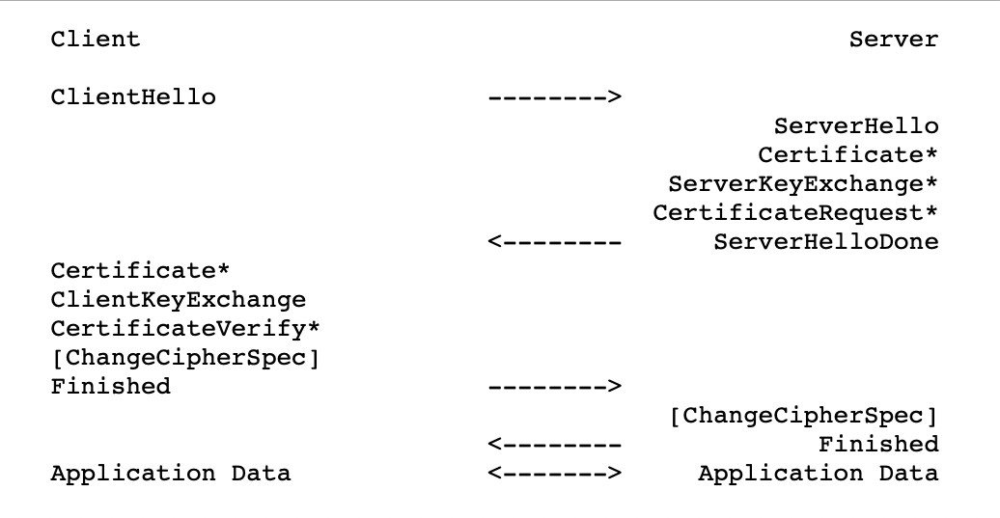

##### 组成部分

根据[RFC-2246](https://www.ietf.org/rfc/rfc2246.txt)可知，TLS协议由两部分：Handshake Protocol握手协议和Record Protocol记录协议共同组成。

- **Handshake Protocol** 用来协商通信双方所使用的的协议版本、密码套件、解压缩方法、随机数等机密信息
  - alert protocol 用于处理错误情况，比如警告和失败等
  - change cipher spec protocol 用于改变当前session中的密码套件等机密信息
  - application data protocol
- **Record Protocol** 是分层协议，主要负责切分数据、（选择性）压缩、加解密、HMAC消息验证，RFC中分为4层，实现者可以额外增加其他层

##### 部署

在升级HTTP为HTTPS的过程中，需要获得两样东西：**证书和密钥对**。一般情况下，服务器实体需要自行生成密钥对，基于密钥对的CSR文件，然后向CA证书颁发机构申请，即可获得CA证书。

### HTTP vs HTTPS

简单来说，HTTPS是HTTP的安全版本。HTTP是基于TCP使用明文传输的应用层协议，HTTPS在TCP和HTTP之间加入了SSL层或者TLS层，用于实现加解密。

- 层次（从上到下）：HTTP-TCP-IP；HTTP-TLS-TCP-IP
- 端口：HTTP是80，HTTPS是443
- 安全性：HTTP不安全，HTTPS安全
- 开销：
  - 加解密：HTTPS因为多了加解密过程，开销大
  - 握手：HTTP只需要TCP的三次握手，而HTTPS除了TCP的三次握手，还要经过多次TLS握手
  - 费用：HTTPS需要申请证书，这需要花费一定的费用

